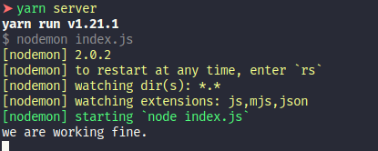

## Used tools

the following tools were used in this API

- [Node.js](https://nodejs.org/docs/latest-v12.x/api/)
- [Yarn](yarnpkg.com/)
- [VsCode](https://code.visualstudio.com)
- [PostgreSQL](https://www.postgresql.org)
- [Sequelize](https://sequelize.org/v5/)
- [sequelize-cli](https://github.com/sequelize/cli)
- [Express.js](expressjs.com)
- [Axios](https://github.com/axios/axios)
- [Bcrypt](https://www.npmjs.com/package/bcrypt)
- [Json Web Token](https://www.npmjs.com/package/jsonwebtoken)
- [Body Parser](https://www.npmjs.com/package/body-parser)
- [Insomnia](https://insomnia.rest)
- [DBeaver](https://dbeaver.io)
- [Nodemon](https://nodemon.io)

## Getting Started

First thing you need to do is make sure that you have installed
- [Node.js](https://nodejs.org/docs/latest-v12.x/api/)
- [Yarn](yarnpkg.com/) or [npm](https://www.npmjs.com/) 

Then you can clone the repository into your computer using
</p>
```git clone https://github.com/jeann47/CodeHunter-api```

You can also download as zip package over the interface
</p>
Now, in the project folder, run:
</p>
```yarn init``` or ```npm install``` to download the dependencies.
</p>
Then you are ready to go

## Available Scripts

In the project directory, you can run:

### `yarn server`

Runs the app in the development mode.<br />
Use [http://localhost:3333](http://localhost:3333).

if you console show something like
</p>

</p>
means that everything is ok

**sequelize**

### `yarn sequelize`

List the commands for [sequelize-cli](https://github.com/sequelize/cli)


### Routes
**baseURL = http://localhost:3333**
*all routes that contains sensitive data are filtered by authentication*
# `Users`

## Get
 - `/users` -> list all the users
 - `/users/:id` -> find one user by id and all his posts

 - `/search/users` -> find all users mathing by name (pass as string in body) or techs (pass as array in body)

## Post
 - `/users/add` -> used to add one user, hashing password and checking login
 - `/login` -> allow the user to log-in using login or email
 
## Put
- `/users/:id` -> used to update personal info about the user by his id by params and changes by body

## Delete
- `/users/:id` -> used to delete a user by his id


# `Posts`

## Get
 - `/posts` -> list all the posts
 - `/posts/:id` -> find one post by id and who wrote it

 - `/search/posts` -> find all posts mathing by title or type (pass as string in body) or tags (pass as array in body)

## Post
 - `/posts/add` -> used to add one post, userId required
 
## Put
- `/posts/:id` -> used to update the info and body of a post by his id by params and changes by body

## Delete
- `/posts/:id` -> used to delete a post by his id

# `Ext`

## Post

- `/youtube` -> return (use post to secure the apiKey) the items of the [youtube api](https://developers.google.com/youtube/v3), still need to handle pagination
